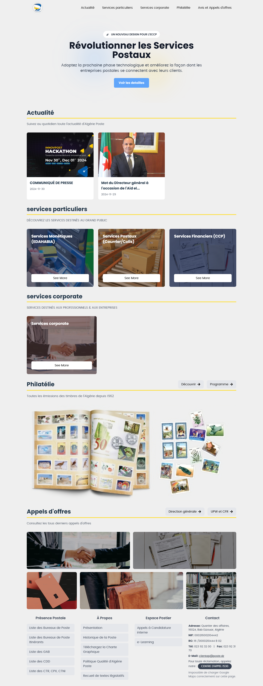

# Algérie Poste Web Application

## Live Demo
[View Live Website](https://benouarabdou.github.io/eccp/)

## Project Vision: Redefining Digital Postal Services

Our web application represents a transformative approach to Algérie Poste's digital presence, combining cutting-edge technology with user-centric design to revolutionize how citizens interact with postal services.




## Why Our Solution Stands Out

### Technological Innovation
- **Rapid Development Ecosystem**: Built with React and Vite, our application demonstrates unprecedented development speed and efficiency.
- **Modern Web Technologies**: Leveraging React and Tailwind CSS ensures:
  - Lightning-fast performance
  - Seamless user experience
  - Minimal load times
  - Highly responsive design

### User Experience Design
- **Minimalist & Calming Interface**: Carefully crafted design with clean colors and smooth edges to reduce user cognitive load
- **Intuitive Navigation**: Removed complex sidebar complications, allowing users to explore services freely and naturally
- **Mobile-First Responsive Design**: Ensures optimal experience across all device types

### Strategic Advantages
- **Prototype with Immense Potential**: This submission is a glimpse into the transformative digital solutions we can deliver
- **Rapid Deployment Capability**: Our technology stack allows for quick iterations and implementation
- **Future-Ready Architecture**: Modular component structure enables easy expansion and feature addition

## Key Features

### Comprehensive Sections
- Responsive Navigation
- Engaging Hero Section
- Dynamic News Updates
- Comprehensive Service Showcases
  - Particular Services
  - Corporate Services
  - Philately Information
  - Job Opportunities

### Technical Highlights
- Single-page application for streamlined user experience
- Responsive, mobile-optimized design
- Dynamic section navigation
- Modular, maintainable component structure

## Technical Implementation

### Technology Stack
- **Frontend**: React
- **Build Tool**: Vite
- **Styling**: Tailwind CSS
- **Additional Libraries**: React Icons, React Hooks

## Development Journey

### Challenges Overcome
- Limited development time due to academic commitments
- Creating a comprehensive prototype within constraints
- Balancing design elegance with functional simplicity

### Future Roadmap
This prototype demonstrates our capability to:
- Rapidly develop complex web applications
- Create user-friendly government service interfaces
- Implement modern web technologies effectively

## Installation & Development

```bash
# Clone the repository
git clone https://github.com/benouarAbdou/eccp

# Install dependencies
npm install

# Run development server
npm run dev

# Build for production
npm run build
```

## Why Choose Our Solution

1. **Speed of Development**: React and Vite enable unprecedented rapid development cycles
2. **User-Centric Design**: Minimalist approach focuses on user comfort and ease of use
3. **Scalability**: Modular architecture allows for easy future enhancements
4. **Performance**: Optimized web technologies ensure fast, responsive experience
5. **Prototype of Potential**: This submission is just a glimpse of our innovative capabilities

## Conclusion

Our Algérie Poste web application is more than just a website—it's a vision of how digital government services can be reimagined. By choosing our solution, you're not just selecting a website, but investing in a future of intuitive, efficient, and user-friendly digital experiences.

## Licensing & Collaboration

- **License**: MIT License
- **Open to Collaboration**: Continuous improvement through community and stakeholder feedback

## Contact

- **Team Contact**: benouarabdelouahab@gmail.com

---

